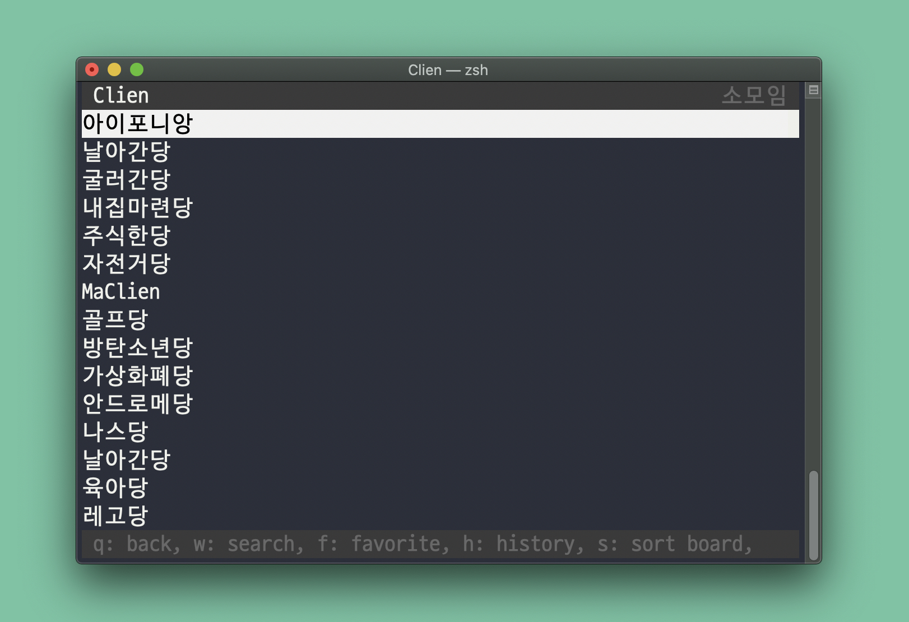

# cliboards &middot; [](https://nodejs.org) [](https://www.npmjs.com/package/cliboards) [](https://npm-stat.com/charts.html?package=cliboards) [](https://github.com/samnoh/cliboards/commits/master) [](https://github.com/samnoh/cliboards/actions?query=workflow%3A%22Node.js+CI%22)

> ⌨️ Surf your online communities on CLI



## Features

-   Browse online communities: `Clien`, `dcinside`, `DVDPrime`, `Ruliweb`, `PPOMPPU` and `SLRClub`
-   Post favorites
-   Post history
-   Search posts
-   Shurtcut for viewing images on default web browser
-   Hides screen instantly (`space` key)
-   May load faster with a slow Internect connection
-   Spoiler protection
-   Color customizations
-   Filters posts by keywords

## Installation

Use the package manager [npm](https://www.npmjs.com) to install `cliboards`.

```bash
# Install globally (highly recommended) or update to the latest version
npm i -g cliboards

# Or run directly (installs CLI on every run).
npx cliboards
```

## Usage

```bash
# Display a list of community
cliboards

# Display the nth community (1 is the first)
cliboards <index>

# Display community for given name (non-case sensitive)
cliboards <name>

# Reset all data including favorites
cliboards --reset

# Reset favorites
cliboards --resetFav

# Reset data for given community only
cliboards <index|name> --reset

# Reset favorites for given community only
cliboards <index|name> --resetFav

# Update theme (color customizations)
cliboards --theme

# Update post filters by keywords
cliboards --filter

# Disable spoiler protection
cliboards --showSpoiler

# Hide comments in order to browse posts faster
cliboards --hideComments

# Hide top and/or bottom bars
cliboards --fullScreen
cliboards --hideTopBar
cliboards --hideBottomBar
```

## Changelog

[Read the changelog here](CHANGELOG.md)

## Contributing

Please do contribute! Issues and pull requests are all welcome.

### Code of Conduct

Please read the [full text](CODE_OF_CONDUCT.md) so that you can understand what actions will and will not be tolerated.

## Licnese

[MIT licensed](LICENSE)
